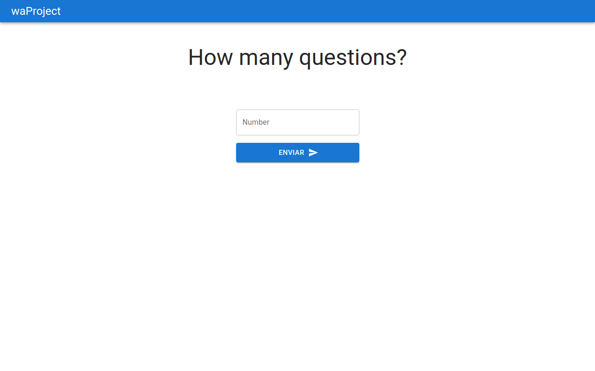

## O projeto
Esse projeto é um jogo de trívia, feito para o usuário escolher de 1 a 50 perguntas, e assim que responder, receber um feedback de quantas e quais perguntas se acertou e errou.

Regras de negócio:
 - O número do input deve ser um inteiro de 1 a 50

[Link do site](https://digital-republic.vercel.app/)



## Como usar

Assim que usuário logar no site, irá aparecer um formulário que é composto por um input, onde será necessário escolher um número inteiro entre 1 e 50. Apertando o botão de enviar, o usuário será redirecionado para uma tela onde poderá dar start no questionário, ou cancelar a operação, voltando para a página inicial. Se o usuário escolher startar, será iniciado o jogo de Trívia, com no final aparecendo a pontuação do jogador e um feedback de quais perguntas acertou e quais errou.

## Como foi desenvolvido

Esse aplicação foi desenvolvida com o framework NextJS com TypeScript, usando a biblioteca de estilização Material UI. Além disso também foi utilizado a biblioteca Formik para melhorar a experiência do usuário e facilitar a validação dos inputs.

- [Trivia API](https://opentdb.com/)
- NextJS
- TypeScript
- MaterialUI
- Formik

## Como fazer a aplicação rodar

Para usar a aplicação, é necessário usar a sequência de comandos abaixo:

```
git clone git@github.com:joaoreisjpk/waProject.git
yarn
yarn dev
```

ou para NPM

`npm install
npm start`

## Maiores desafios

- 1º Fazer a validação dos dados, com todas as limitações existentes
- 2º Trazer a melhor experiência de usuário, refatorando algumas vezes o código para trazer uma melhor solução
- 3º Lidar com a randomização das respostas e com o resumo, mostrando as respostas certas e erradas.

## Observações

- Durante o código foram feitas observações para melhor compreenção da minha lógica/escolha, estas observações se encontram no início do `src/helpers/index.ts` e no meio da função `latasDeTinta` na `src/resultado/index.ts`
- As outras observações são de menor importância e podem ser lidas durante a compreenção do código
